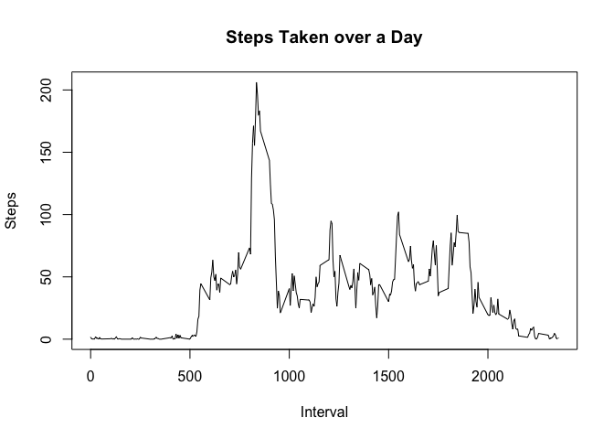

# Reproducible Research: Peer Assessment 1

```r
library(dplyr)
```

## Loading and preprocessing the data
The code bellow expects activity.zip to be extracted.


```r
data = read.csv('activity.csv')
data$date = as.Date(data$date)
head(data, n=5)
```

```
##   steps       date interval
## 1    NA 2012-10-01        0
## 2    NA 2012-10-01        5
## 3    NA 2012-10-01       10
## 4    NA 2012-10-01       15
## 5    NA 2012-10-01       20
```

Five first rows does not tell us much about data set. Let's see random sample:


```r
data[sample(nrow(data), 5),]
```

```
##       steps       date interval
## 4631      0 2012-10-17      150
## 4397      0 2012-10-16      620
## 1906      0 2012-10-07     1445
## 11110     0 2012-11-08     1345
## 11956   476 2012-11-11     1215
```

## What is mean total number of steps taken per day?


```r
total_steps = sapply(split(data$steps,data$date), sum, na.rm=TRUE)
```

The mean and median of the total number of steps taken per day:


```r
mean(total_steps)
```

```
## [1] 9354.23
```

```r
median(total_steps)
```

```
## [1] 10395
```

Total steps distribution:


```r
hist(total_steps, breaks=10)
```


## What is the average daily activity pattern?


```r
timeline = aggregate(steps ~ interval, data, mean)
plot(timeline, type='l')
```




```r
timeline = aggregate(steps ~ interval, data, mean)
print(timeline$interval[max(timeline$steps) == timeline$steps])
```

```
## [1] 835
```

## Imputing missing values


```r
# Incomplete readings:
sum(!complete.cases(data))
```

```
## [1] 2304
```

```r
# Complete readings:
sum(complete.cases(data))
```

```
## [1] 15264
```

Let's impute the missing data with the mean for that 5-minute interval: 


```r
avg_steps <- sapply(split(data$steps, data$interval), mean, na.rm=TRUE)
imputed <- ifelse(is.na(data$steps), avg_steps[as.character(data$interval)], data$steps)

imputed_data = mutate(data, steps = imputed)
```


```r
total_steps_imputed = sapply(split(imputed_data$steps,imputed_data$date), sum, na.rm=TRUE)
```

Total steps distribution:


```r
hist(total_steps_imputed, breaks=10)
```


The mean and median of the total number of steps taken per day:


```r
mean(total_steps_imputed)
```

```
## [1] 10766.19
```

```r
median(total_steps_imputed)
```

```
## [1] 10766.19
```

**Both mean and median are higher. Inputing values increases the estimates of the total daily number of steps.**

## Are there differences in activity patterns between weekdays and weekends?


```r
data$dow <- as.factor(ifelse(as.POSIXlt(data$date)$wday %in% c(0,6), 'weekend', 'weekday'))

weekdays = data[data$dow == 'weekday',]
weekends = data[data$dow == 'weekend',]

weekdays_timeline = aggregate(steps ~ interval, weekdays, mean)
weekends_timeline = aggregate(steps ~ interval, weekends, mean)

plot(weekends_timeline$interval, weekends_timeline$steps, type='l')
lines(weekdays_timeline$interval, weekdays_timeline$steps, type='l', col='red')
```


